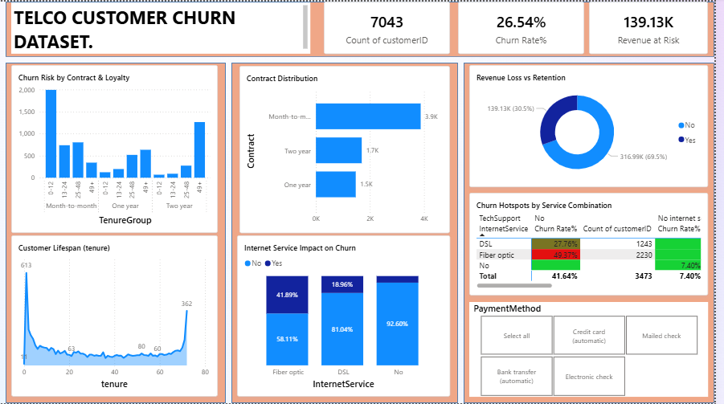

# FUTURE_DS_02: Telco Customer Churn Dataset (Kaggle)

**Track Code:** DS  
**Internship Task:** 02

## Project Overview
This project analyzes a telecommunications dataset to identify why customers are leaving and which segments are at the highest risk. The goal is to provide data-driven recommendations to improve retention.

## Key Insights
* The "Danger Zone": Churn spikes significantly in the first 6 months of tenure.
* High-Risk Contracts: Month-to-month customers are more likely to churn than 2-year contract holders.
* Service Gaps: Fiber optic customers without Tech Support or Online Security represent the highest "Revenue at Risk."
* Financial Impact: Identified 120.85K in monthly recurring revenue currently at risk.

## Tools Used
*Excel/Google Sheets: Did a bit of cleaning by removing empty cells and simple calculations for the service groups.
* Power BI: Data Cleaning (Power Query), Modeling, and Visualization and created measures for Churn Rate%, Revenue at Risk 

## 📂 Project Resources
Click the links below to access the full analysis files:

* 📊 [Download Power BI Dashboard](Telco_Customer_Churn_Dataset..pbix)

## 🖼️ Dashboard Preview

